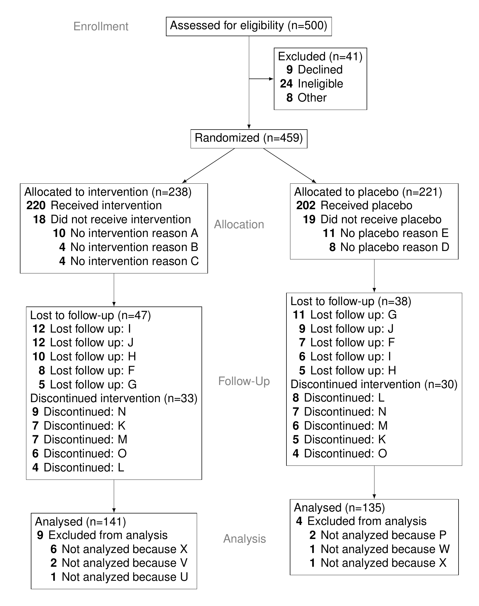

<!-- README.md is generated from README.Rmd. Please edit that file -->

# consoRt

[](https://www.tidyverse.org/lifecycle/#experimental)

The goal of consoRt is to …

## Installation

You can install the development version of `consoRt` from GitHub:

``` r
devtools::install_github("gerkelab/consoRt@dev")
```

## Quick Example

For a trial of 500 patients.

``` r
library(consoRt)
study_data <- consoRt::study_data
```

|  id | metadata              | eligible   | allocation   | intervention | intervention\_excl\_reason | placebo | placebo\_excl\_reason | lost\_reason      | discontinued\_reason | analyzed | analyzed\_excl\_reason |
| --: | :-------------------- | :--------- | :----------- | :----------- | :------------------------- | :------ | :-------------------- | :---------------- | :------------------- | :------- | :--------------------- |
|  23 | Mr. Tyrone O’Kon      | Ineligible | NA           | NA           | NA                         | NA      | NA                    | NA                | NA                   | NA       | NA                     |
|  33 | Dr. Percy Moore       | Eligible   | Intervention | FALSE        | No intervention reason A   | NA      | NA                    | NA                | NA                   | NA       | NA                     |
| 179 | Madora Homenick       | Eligible   | Placebo      | NA           | NA                         | TRUE    | NA                    | NA                | Discontinued: M      | NA       | NA                     |
| 270 | Odell Kuvalis DDS     | Eligible   | Placebo      | NA           | NA                         | TRUE    | NA                    | NA                | NA                   | TRUE     | NA                     |
| 303 | Dr. Korey O’Reilly IV | Other      | NA           | NA           | NA                         | NA      | NA                    | NA                | NA                   | NA       | NA                     |
| 351 | Isla Grimes           | Eligible   | Intervention | TRUE         | NA                         | NA      | NA                    | NA                | NA                   | TRUE     | NA                     |
| 398 | Mr. Erling Paucek DVM | Eligible   | Placebo      | NA           | NA                         | TRUE    | NA                    | Lost follow up: F | NA                   | NA       | NA                     |
| 442 | Shelba Lakin          | Eligible   | Placebo      | NA           | NA                         | FALSE   | No placebo reason E   | NA                | NA                   | NA       | NA                     |
| 488 | Joslyn Greenholt DDS  | Eligible   | Placebo      | NA           | NA                         | TRUE    | NA                    | NA                | NA                   | TRUE     | NA                     |

``` r
consort <- write_consort(study_data, "man/figures/README-consort-diagram.png")
#> writing temp tex file to: /var/folders/0n/sldqyy0s2713kh94byt0gttc001jc5/T//RtmpFBdCto/file70555bc75d78.tex
#> converting to png: /var/folders/0n/sldqyy0s2713kh94byt0gttc001jc5/T//RtmpFBdCto/file70557dc9a05a.pdf

knitr::include_graphics(consort)
```


